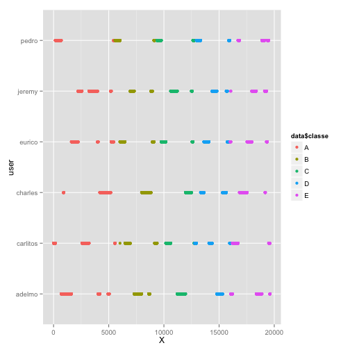
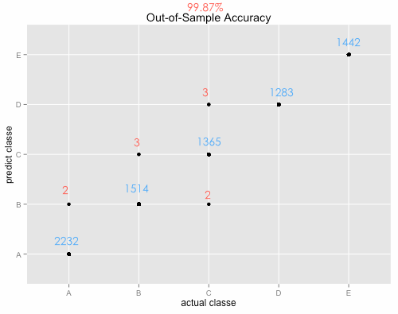
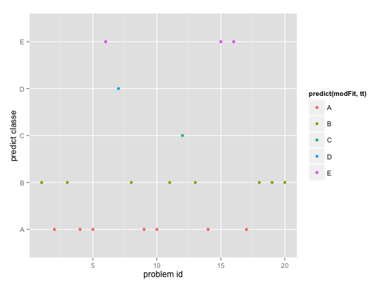

## Overview (prediction mechanism and outcome)

* nearZeroVar() for data pre-process
* Random Forest for model training
* K-fold cross validation (k=10)
* 100% In-Sample accuracy, 99.87% Out-of-Sample accuracy
* 100% accuracy on pml-testing.csv prediction

---

## Data pre-processing - handle missing values

```
## Warning: package 'caret' was built under R version 3.1.2
```

```
## Loading required package: lattice
## Loading required package: ggplot2
```

```r
data = read.csv('pml-training.csv'); data2 = read.csv('pml-testing.csv')
dim(data);
```

```
## [1] 19622   160
```
In data2, we can see lots of NA value, we should skip those columns in building model

```r
nzv <- nearZeroVar(data2) #in this case, nearZeroVar can help remove missing data 
data <- data[,-nzv] # note: we can apply nzv found on data2 to data because
dim(data) # the column name and order in pml-testing.csv is same with pml-training.csv
```

```
## [1] 19622    59
```
Then the training set now has 59 columns (58 predictors + 1 target column)

---

## Data pre-processing - remove more predictors 

```r
qplot(data$X,data$user_name,colour=data$classe,xlab="X",ylab="user")
```

 

---

## Data pre-processing 
As shown in the graph on previous page, 'X' is just a sequence id for each data row and might cause severe bias. (In my test includes this predictor, it has dominant varImp() and result in my prediction on 20 dataset are all 'A' because they have small problem_id as 1-20 ) 

```r
data <- data[,-1] # remove 'X' column which is in the first position 
```
Partition the data into training set and testing set by 60-40 ratio

```r
inTrain <- createDataPartition(y=data$classe,p=0.6, list=F)
training <- data[inTrain,];testing <- data[-inTrain,]
dim(training);dim(testing)
```

```
## [1] 11776    58
```

```
## [1] 7846   58
```
Now we have 57 predictors (another one is target variable) to build our model

---

## Training mechanism (cross-validation and random forest)

Here I apply cross validation to better indepdently estimate accuracy.
I set k=10 hope to have less bias.
Random forest method take relatively longer (around 20-30 mins in my machine), but accuracy is good, compare with 'rpart'.

```r
myTC = trainControl(method="cv",number=10)
modFit <- train(classe~.,data=training,method="rf",trControl=myTC)
```
### Random Forest 

* 11776 samples, 57 predictors, 5 classes: 'A', 'B', 'C', 'D', 'E'
* Type of random forest: classification.
* Number of trees: 500. No. of variables tried at each split: 40
* OOB estimate of  error rate: 0.08%    
    
    


---

## Out-of-sample error and prediction outcome

we can use qplot (or confustionMatrix) function to show the prediction based on the model

```r
qplot(predict(modFit,testing),classe,data=testing,main="Out-of-Sample Accuracy", 
      xlab="predict classe", ylab="actual classe")
```

#### The 99.87% Out-of-Sample accuracy is still high enough. (and the model has 100% In-Sample accuracy)

--- 

## Prediction on data in pml-testing.csv

```r
qplot(data2$problem_id,predict(modFit,data2), colour=predict(modFit,data2),
      xlab="problem id",ylab="predict classe", height="100")
```

#### It has 100% of accuracy (all passed online grader)

---

## Other - rf variable importance

After check with varImp(), It's interesting that this random forest model mostly use 'raw_timestamp_part_1', 'roll_belt ', and 'num_window' to make prediction 

```r
varImp(modFit)
```
<table>
<tr>
<td>
Overall
</td>
<td></td>
<tr><td>100.000</td><td>raw_timestamp_part_1 </td></tr>
<tr><td>44.774</td><td>roll_belt</td></tr>
<tr><td>43.274</td><td>num_window</td></tr>
<tr><td>26.395</td><td>pitch_forearm</td></tr>
<tr><td>19.331</td><td>magnet_dumbbell_z</td></tr>
<tr><td>15.382</td><td>magnet_dumbbell_y</td></tr>
<tr><td>(below omitted....)</td><td></td></tr>
</table>
